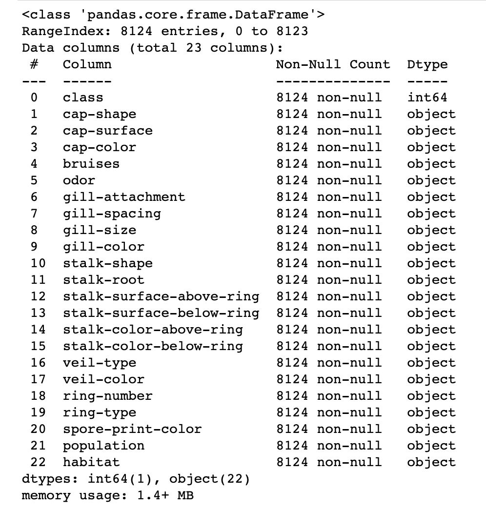
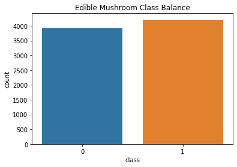
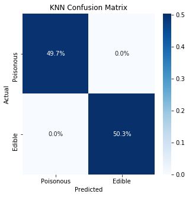
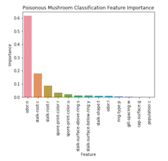

# Poisonous Mushroom Classification
## Introduction
My modeling goal was to build a model that could predict whether a mushroom is poisonous based upon its features, which would quickly allow mushroom foragers to predict whether a mushroom is edible or not.  I downloaded the data in csv form from Kaggle and read it into pandas, resulting in 8,124 datapoints.  I modeled the data with KNN Classification and Decision Tree Classification.  Both models had test set f1 scores of 1.0, outperforming the Dummy Classifier baseline model test set f1 score of .50.  Feature Importance analysis on the Random Forest model revealed that 'odor:n' was the most important feature with a score of .62.

## Obtain Data
I downloaded the Mushroom Classification dataset from Kaggle. The dataset contained 8,124 datapoints each with 22 categorical features.  

## Scrub Data

As an off the shelf dataset, the mushroom csv did not have any missing values or extra columns.  To scrub the data, I created dummy variables for each of the dataset's variables, which were all categorical.  

## Explore Data

The mushroom dataset included 22 categorical independent variables, which resulted in 95 dummy variables. This compared to 8,124 total datapoints, which represented sufficient sample size as well as a reasonable balance between features and datapoints.  Class balance was split 52/48 in favor of edible mushrooms, which I deemed to be a reasonable class balance for use with an f1 score evaluation metric.

## Model Data

I used f1 score as my principle evaluation metric in order to create a model that would accurately predict both poisonous and edible mushrooms. I used a 75/25 Train Test Split to validate my models.  The baseline Dummy Classifier model produced a test set f1 score of .50.  The K Nearest Neighbors model with k=1 improved the test set f1 score to 1.0, representing a very strong model.  

Decision tree also had a test set f1 score of 1.0 with the added benefit of interpretable feature importance. 13 features were used in the decision tree model with 'odor:n' as the most important feature with a score of .62 followed by 'stalk-root:c' (.18) and 'stalk-root:r' (.09).  No other feature had an importance greater than .05.

## Analyze Results
KNN and Decision Tree modeling outperformed the baseline model f1 score of .50, both with strong f1 scores of 1.0. Decision Tree Feature Importance revealed that the most importance feature in classifying mushrooms as poisonous or edible was lack of an odor with a value of .62.

## Next steps
With more time, I would do feature selection to determine the model with the fewest features that could maintain an f1 score of 1.0.

# Github Files
[Modeling.ipynb](https://github.com/blantj/mushroom_classification/blob/master/Modeling.ipynb) :  Poisonous mushroom classification modeling

# Sources
Kaggle: https://www.kaggle.com/uciml/mushroom-classification
